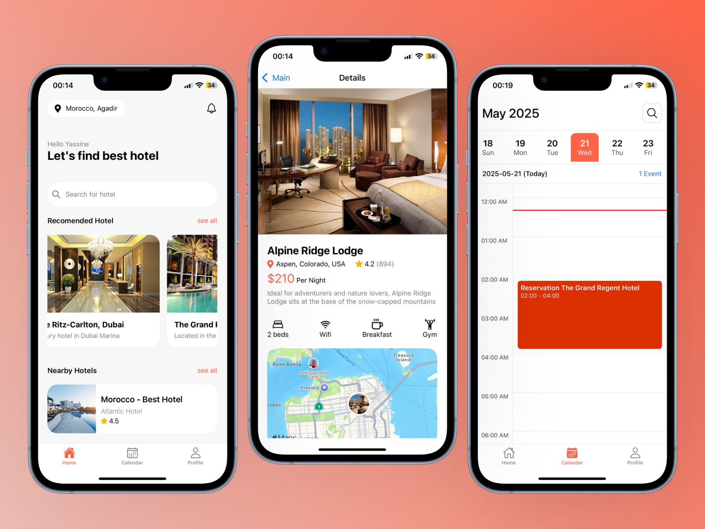

# 🏨 HotelBookingApp – Application de réservation d’hôtel

**HotelBookingApp** est une application web moderne qui permet aux utilisateurs de parcourir, réserver, et gérer des séjours dans des hôtels à travers une interface intuitive.

---

## ✨ Fonctionnalités principales

- 🔍 Recherche d’hôtels par ville, dates, et nombre de voyageurs
- 🏨 Visualisation des détails d’un hôtel avec photos et équipements
- 📅 Réservation de chambres en quelques clics
- 👤 Connexion / inscription utilisateur
- 📜 Historique des réservations
- 💳 Paiement sécurisé (mock intégré)

---

## 🖼️ Aperçu de l’interface



---

## 🚀 Lancer le projet en local

### Prérequis

- Node.js
- MongoDB (ou un service cloud comme MongoDB Atlas)

### Étapes

```bash
git clone https://github.com/Prog-yassine/booking-app.git
cd hotelbookingapp
npm install
npm run dev
